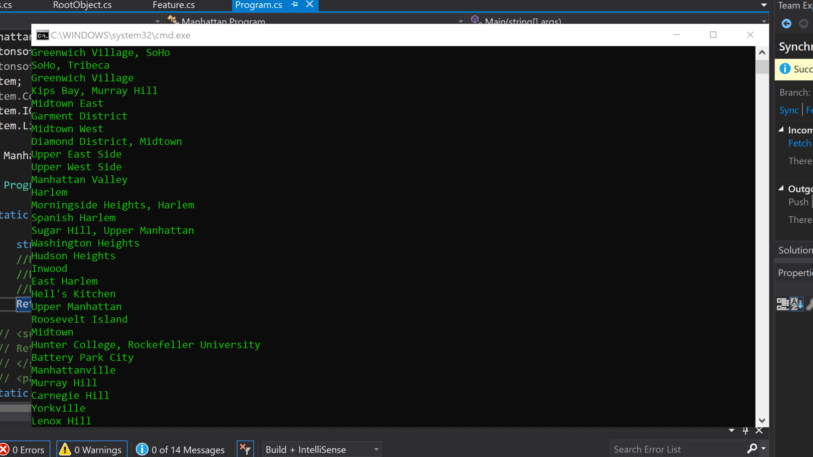

# Lab-8-LINQ

This program uses NewtonSoft LINQ to JSON to read a json file and query the neighborhoods in Manhattan. I wrote methods to query and remove blank spaces in a JSON file (I also made another method that use lambda instead of LINQ to do the same thing), and a function to query and remove duplicate neighborhoods in a JSON file, finally I wrote a function to query  and remove blank spaces and duplicates to return the neighborhoods from the JSON file.

# Screenshot

